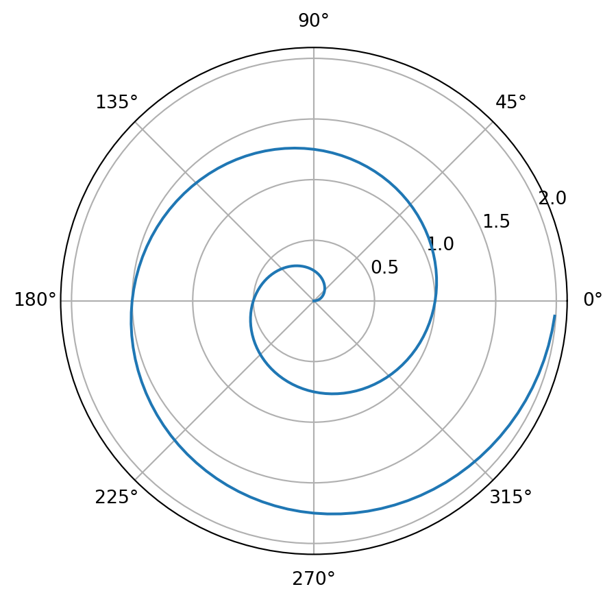

## Polar Axis

For a demonstration of a line plot on a polar axis, see [Figure 1](#fig-polar).

<figure>

<figcaption aria-hidden="true">Figure 1: A line plot on a polar axis</figcaption>
</figure>
