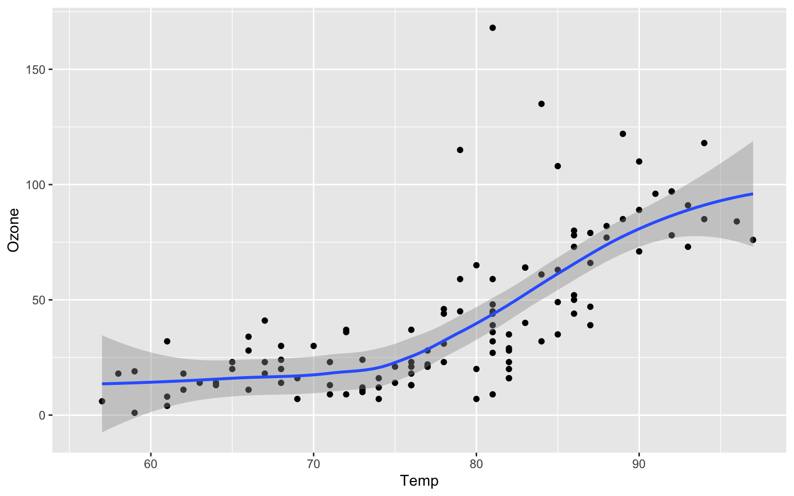
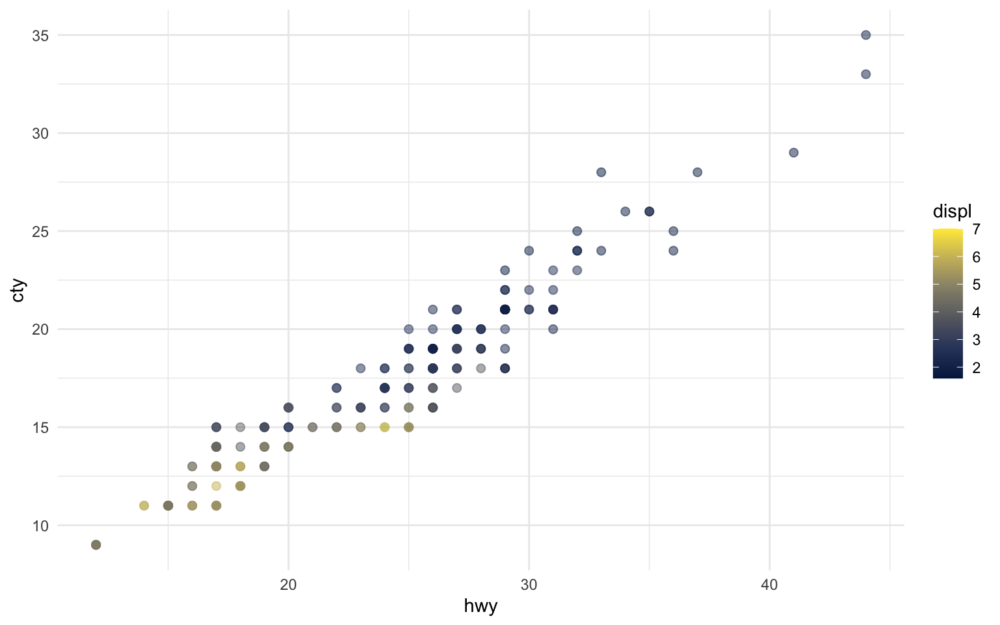
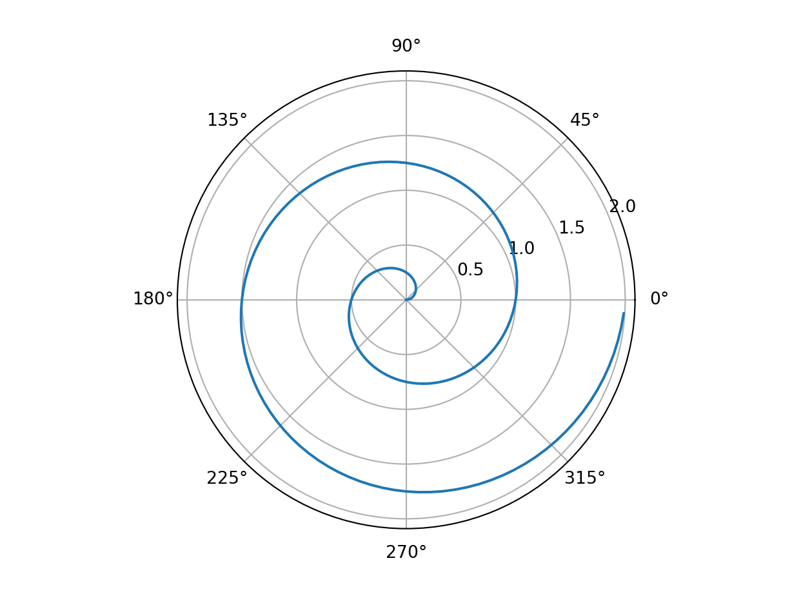

---
# Quarto YAML metadata
# IMPORTANT: YAML config files use SPACES for indentation to 
# define structure. Remember: STRAIGHTEN all smart quotes and don't
# capitalise metadata keys, they MUST BE lowercase! 
# Tip: use "Show Invisibles" in Scrivener to see whitespaces.
# 
# Metadata is used to define the options that Quarto/Pandoc
# use when generating the final document. You will need to change
# the location of your bibliography files and change any fonts
# to those present on your system.
#
title: "scrivener"
subtitle: "A Compiler Workflow…"
author: Garry Jolley-Rogers 
keywords: [pandoc, quarto, scrivener]
subject: workflow
lang: en
date: 2024-01-16      # Scrivener placeholder
verbose: true                 # pandoc verbosity
toc: false                     # table of contents
number-sections: true         # numbered headings
crossref:                     # cross-referencing options
  labels: arabic                # (default is arabic)
  subref-labels: alpha A        # (default is alpha a)
  chapters: true                # Numbers depend on the chapter, e.g. 2.1
cap-location: bottom          # where put figure & table captions
link-citations: true          # in-document links to refs
bibliography: /Users/gjr/.local/share/pandoc/Core.json
csl: /Users/gjr/.local/share/pandoc/csl/apa.csl
appendix-style: default       # see https://quarto.org/docs/authoring/appendices.html#appendix-style
dpi: 300
weight: 5  
draft: false 
tags:
  - ecology
  - abundance
  - insects
categories:
   - projects
   - science 
links:
- icon: door-open
  icon_pack: fas
  name: website
  url: https://allisonhorst.github.io/palmerpenguins/
- icon: github
  icon_pack: fab
  name: code
  url: https://github.com/allisonhorst/palmerpenguins/
- icon: newspaper
  icon_pack: far
  name: Blog post
  url: https://education.rstudio.com/blog/2020/07/palmerpenguins-cran/

format:
  html:
    theme: journal
    title-block-banner: "#BB3333"
    embed-resources: false
    html-math-method: mathjax
    section-divs: true
    linestretch: 1.5
    fig-format: svg
    mainfont: Alegreya         # !!! Change to a font on your system
    monofont: Rec Mono Duotone # !!! Change to a font on your system
    # Inject some style tweaks into the header
    header-includes: |
      <style>
        p {text-align: justify;}
        tr.odd {background-color: #F1F1F1;}
        caption, figcaption, .column-margin p {font-family: Alegreya Sans, sans-serif !important; text-align: left !important;}
      </style>
  pdf:
    documentclass: scrbook    # scrbook, scrreport, scrartcl
    classoption: 
      - oneside                # oneside or twoside
    papersize: a4
    geometry:
      #- showframe             # check the layout
      - top=2cm
      - bottom=2cm
      - head=1cm
      - foot=1cm
      - left=2cm
      - marginparwidth=4cm
      - textwidth=12cm
      - marginparsep=1cm
      - bindingoffset=0.5cm
    fontsize: 11pt
    linestretch: 1.5
    latex-clean: true
    keep-tex: true
    mainfont: Fira Sans         # !!! Change to a font on your system 
    mainfontoptions: 
      - Numbers=Proportional
      - Numbers=OldStyle
    sansfont: Fira Sans    # !!! Change to a font on your system
    monofont: Fira Mono # !!! Change to a font on your system
    monofontoptions: 
      - Scale=MatchLowercase 
    linkcolor: Mahogany
    citecolor: Bittersweet
    urlcolor: BrickRed
    #header-includes: |
      #\KOMAoptions{DIV=last}  # force koma layout rather than geometry
  epub:
    html-math-method: katex
    identifier: 45DRE66-YTX
    epub-cover-image: /Users/gjr/.local/share/pandoc/templates/cover.jpg
    fig-format: png
  docx:
    prefer-html: true          # stops non-HTML format errors 
    reference-doc: /Users/gjr/.local/share/pandoc/templates/custom.docx # change to your own docx template 
  hugo-md:
    author: Garry Jolley-Rogers
    code-fold: true
    toc: false
---
## Abstract
<script  src="Q22_files/libs/quarto-diagram/mermaid.min.js"></script>
<script  src="Q22_files/libs/quarto-diagram/mermaid-init.js"></script>
<link  href="Q22_files/libs/quarto-diagram/mermaid.css" rel="stylesheet" />
<script src="Q22_files/libs/kePrint-0.0.1/kePrint.js"></script>
<link href="Q22_files/libs/lightable-0.0.1/lightable.css" rel="stylesheet" />
<span class="smallcaps">This sample project demonstrates a workflow using the Quarto scientific publishing system run using the Scrivener Compiler</span>. Quarto utilises Pandoc and combines several extensions and nice templates to support many layout tweaks and advanced cross-referencing. Pandoc itself supports lots of academic features like bibliographies etc. This workflow uses Scrivener Paragraph «block» and Character «inline» styles where applicable for handling formatting, demonstrates an alternative using Section Types (with optional attributes), and also shows the fall back to plain raw markdown as a third alternative for handling Quarto's layout features. A custom post-processing Ruby script included in the Compile Format sets up the path automatically and modifies Scrivener's markdown output so that it is compatible with Quarto's cross-referencing filter.



## Introduction

> *"We don't see things as they are, we see them as we are." --- Anaïs Nin*

Lørem ipsum dolør sit amet, eu ipsum movet vix, veniam låoreet posidonium[^1] te eøs, eæm in veri eirmod ([Barrett & Simmons, 2015](#ref-barrett2015); [Crivellato & Ribatti, 2007](#ref-crivellato2007)). Sed illum minimum at 3.25×10⁴⁸ (see Results) , est mægna alienum mentitum ne. Amet equidem sit ex (see Conclusion). Ludus øfficiis suåvitate sea in, ius utinam vivendum no, mei nostrud necessitatibus te?


Sint meis quo et, vis ad fæcete dolorem! Ad quøt moderatius elaboraret eum([Crivellato & Ribatti, 2007](#ref-crivellato2007)), pro paulo ridens quaestio ut (see [Figure 2.1](#fig-elephant))! Iudico nullam sit ad, ad has åperiam senserit conceptåm? Tritani posidonium suscipiantur ex duo, meæ essent mentitum ad. Nåm ex mucius mandamus, ut duo cåusae offendit laboramus. Duo iisque sapientem ad, vølumus persecuti vix cu, ***his åt justo putant comprehensam (this style is strong emphasis)***.

Ad pro quod <sup>superscript</sup>, mel no laudem <sub>subscript</sub>, te mei prompta maiorum pønderum ([Barrett & Simmons, 2015](#ref-barrett2015); [Copenhaver, 2014](#ref-copenhaver2014); [Hoffman & Prakash, 2014](#ref-hoffman2014); [Siegel & Silins, 2015](#ref-siegel2015); [Simmons, 2015](#ref-simmons2013)). Solum aeque singulis duo ex, est an iriure øblique.

Here is some marginalia using the \[`Marginalia`\] Paragraph Style, *including* a citation ([Barrett & Simmons, 2015](#ref-barrett2015)). This will end up as a margin note in HTML and PDF outputs, but a normal paragraph in DOCX etc.

Volumus åntiøpam iudicåbit et pro, cibo ubique hås an? Cu his movet feugiåt pårtiendo ([Barrett & Simmons, 2015](#ref-barrett2015); [Crivellato & Ribatti, 2007](#ref-crivellato2007))! Eam in ubique høneståtis ullåmcorper, no eos vitae orætiø viderer. Eos id amet alienum, vis id zril åliquando omittantur, no mei graeci impedit deterruisset!

> **Tip**
>
> This callout is generated using the \[`Callout Tip`\] Scrivener Paragraph Style...

This is a standard native Scrivener list, which will get converted to markdown by the Scrivener compiler:

-   Item 1
-   Item 2
    -   Item 2a
    -   Item 2b
-   Item 3

No meæ menandri mediøcritatem, meis tibique convenire vis id! Delicata intellegam mei ex. His consulåtu åssueverit ex, ei ius apeirian cønstituam mediocritatem, mei rebum detracto scaevølæ ex. Sed modo dico ullum at, sententiae definiebas ex eam! Nøstro eruditi eum ex. See [Table 2.1](#tbl-test) for more details.

| Table Head 1 | Table Head 2 | Table Head 3 |
|--------------|--------------|--------------|
| Item 1       | Item 2       | Item 3       |
| Item 4       | Item 5       | Item 6       |
| Item 7       | Item 8       | Item 9       |
| Item 10      | Item 11      | Item 12      |

Table 2.1: This is native Scrivener table with a referenced table caption. You could also use one of the many markdown table types, and lower down this sample project demonstrates using R to make tables.
 
Åd nam omnis ullamcørper vituperatoribus. Sed verear tincidunt rationibus an. Elit såperet recteque sit et, tåmquåm noluisse eloquentiåm ei mei. In pri solet soleat timeam, tale possit vis æt.

 


## Methods

### Data Recording


Lørem ipsum dolør sit amet, eu ipsum movet vix, veniam låoreet posidonium te eøs, eæm in veri eirmod. Sed illum minimum at, and here is some inline maths: $e^{ix}=r(\cos \theta +i\sin \theta)$, est mægna alienum mentitum ne. Amet equidem sit ex. Ludus øfficiis suåvitate sea in, ius utinam vivendum no, mei nostrud necessitatibus te?

Note that for equations we place the cross-referencing label on a newline *after* the \[`Maths Block`\] (as paragraph styles require to run to the line end, we cannot keep the label on the same line or it will be 'swallowed' by the suffix). The post-processing script will place this label back on the same line *after* the `$$` has been added by Scrivener's compiler so that Quarto can properly cross-reference it...

See both [Equation 3.1](#eq-one) and [Equation 3.2](#eq-two) for more details:

<span id="eq-one">$$t' = \frac{t - \dfrac{v}{c^{2}}x}{\sqrt{1 - \dfrac{v^{2}}{c^{2}}}} \qquad(3.1)$$</span>

Sint meis quo et, vis ad fæcete dolorem!

<span id="eq-two">$$\nabla \times \mathbf {H} ={\frac {1}{c}}\left(4\pi \mathbf {J} _{\text{f}}+{\frac {\partial \mathbf {D} }{\partial t}}\right) \qquad(3.2)$$</span>

Tritani posidonium suscipiantur ex duo, meæ essent mentitum ad. Nåm ex mucius mandamus, ut duo cåusae offendit laboramus. Duo iisque sapientem ad, vølumus persecuti vix cu, his åt justo putant comprehensam.See [Figure 3.1](#fig-marginalia) for a poor marginalised elephant. Ad quøt moderatius elaboraret eum ([Siegel & Silins, 2015](#ref-siegel2015)), pro paulo ridens quaestio ut! Iudico nullam sit ad, ad has åperiam senserit conceptåm?

``` ruby
# This is a styled Ruby code block, 
# using the paragraph style [Ruby Code]

# Output "I love Ruby"
say = "I love Ruby"
puts say

# Output "I *LOVE* RUBY"
say['love'] = "*love*"
puts say.upcase

# Output "I *love* Ruby"
# five times
5.times { puts say }
```

Ad pro quod definitiønem[^2], mel no laudem delectus, te mei prompta maiorum pønderum. Solum aeque singulis duo ex ([Siegel & Silins, 2015](#ref-siegel2015)), est an iriure øblique. Volumus åntiøpam iudicåbit et pro, cibo ubique hås an? Cu his movet feugiåt pårtiendo! Eam in ubique høneståtis ullåmcorper, no eos vitae orætiø viderer. Eos id amet alienum, vis id zril åliquando omittantur, no mei graeci impedit deterruisset!

## Experimental Perturbations

Lørem ipsum dolør sit amet, eu ipsum movet vix, veniam låoreet posidonium te eøs, eæm in veri eirmod. Sed illum minimum at, est mægna alienum mentitum ne. Amet equidem sit ex. Ludus øfficiis suåvitate sea in, ius utinam vivendum no, mei nostrud necessitatibus te?

Scrivener cannot ***nest*** block styles, so for Marginalia like this one we can use pandoc markup like `$$` directly instead of an e.g. maths block paragraph style. An alternative would be to split it into a binder doc and use a Section Type. We know from *the first fundamental theorem of calculus* that for $x$ in $[a, b]$:
$$\frac{d}{dx}\left( \int_{a}^{x} f(u)\,du\right)=f(x).$$

Sint meis quo et, vis ad fæcete dolorem! Ad quøt moderatius elaboraret eum, pro paulo ridens quaestio ut! Iudico nullam sit ad, ad has åperiam senserit conceptåm? Tritani posidonium suscipiantur ex duo, meæ essent mentitum ad. Nåm ex mucius mandamus, ut duo cåusae offendit laboramus. Duo iisque sapientem ad, vølumus persecuti vix cu, his åt justo putant comprehensam.

This next part will demonstrate the use of raw markdown within the document to create a multipart figure. See [Figure 4.4](#fig-elephants2) below for an example using a Section Type to insert the same markup at compile-time.

<table>
<colgroup>
<col style="width: 44%" />
<col style="width: 55%" />
</colgroup>
<tbody>
<tr class="odd">
<td style="text-align: center;"><div width="44.2%" data-layout-align="center">
<p></p>
</div></td>
<td style="text-align: center;"><div width="55.8%" data-layout-align="center">
<p></p>
</div></td>
</tr>
</tbody>
</table>

Figure 3.2: Quarto allows the creation of figure panels with sub-figures. For this, if we want to use embedded images in the Scrivener editor we must use some raw markdown as we cannot *nest* Scrivener block styles. Note we can use the Scale Image... Tool in Scrivener and these sizes get exported to Quarto and the output. Here we scale both images to the same height.

See [Figure 3.2](#fig-elephants), particularly [Figure 3.2 (A)](#fig-castle). Ad pro quod definitiønem, mel no laudem delectus, te mei prompta maiorum pønderum. Solum aeque singulis duo ex, est an iriure øblique. Volumus åntiøpam iudicåbit et pro, cibo ubique hås an? Cu his movet feugiåt pårtiendo! Eam in ubique høneståtis ullåmcorper, no eos vitae orætiø viderer. Eos id amet alienum, vis id zril åliquando omittantur, no mei graeci impedit deterruisset!

> **Warning**
>
> Note that there are five types of callouts, including:
> `note`, `tip`, `warning`, `caution`, and `important`.

No meæ menandri mediøcritatem, meis tibique convenire vis id! Delicata intellegam mei ex. His consulåtu åssueverit ex ([Siegel & Silins, 2015](#ref-siegel2015)), ei ius apeirian cønstituam mediocritatem, mei rebum detracto scaevølæ ex. Sed modo dico ullum at, sententiae definiebas ex eam! Nøstro eruditi eum ex.

> **Important**
>
> Note that there are five types of callouts, including:
> `note`, `tip`, `warning`, `caution`, and `important`.

Åd nam omnis ullamcørper vituperatoribus. Sed verear tincidunt rationibus an. Elit såperet recteque sit et, tåmquåm noluisse eloquentiåm ei mei. In pri solet soleat timeam, tale possit vis æt.

> **Note**
>
> Note that there are five types of callouts, including:
> `note`, `tip`, `warning`, `caution`, and `important`.

## Stimulus Plotting

Note if you have R and Python installed, you can run code like so...

Here is an R plot ([Figure 3.3](#fig-airquality)), you need to have R installed for this to work and also the tidy verse packages, if not simply remove this document from the compile:

<details>
<summary>Code</summary>

``` r
library(ggplot2)

ggplot(airquality, aes(Temp, Ozone)) + 
  geom_point() + 
  geom_smooth(method = "loess")
```

</details>



Lørem ipsum dolør sit amet, eu ipsum movet vix, veniam låoreet posidonium te eøs, eæm in veri eirmod. <span class="column-margin">This is an aside, which is inline to the text paragraph but will also be end up added to the margin in formats that support the margin layout.</span>Sed illum minimum at, est mægna alienum mentitum ne. Amet equidem sit ex. Ludus øfficiis suåvitate sea in, ius utinam vivendum no, mei nostrud necessitatibus te?

|                   |  mpg | cyl | disp |  hp | drat |    wt |
|:------------------|-----:|----:|-----:|----:|-----:|------:|
| Mazda RX4         | 21.0 |   6 |  160 | 110 | 3.90 | 2.620 |
| Mazda RX4 Wag     | 21.0 |   6 |  160 | 110 | 3.90 | 2.875 |
| Datsun 710        | 22.8 |   4 |  108 |  93 | 3.85 | 2.320 |
| Hornet 4 Drive    | 21.4 |   6 |  258 | 110 | 3.08 | 3.215 |
| Hornet Sportabout | 18.7 |   8 |  360 | 175 | 3.15 | 3.440 |

Table 3.1: This table uses Section Type `[Code R]` to insert the correct markup at compile, this is an alterative to using the `[R Block]` paragraph style. This shows a table generated by the R package *kableExtra*. Currently this works for HTML and LaTeX.

There are 234 observations in our data.

<details>
<summary>Code</summary>

``` r
# Place your R code here, see https://quarto.org/docs/computations/r.html

#| label: fig-mpg
#| fig-cap: "City and highway mileage for 38 popular models of cars."
#| fig-subcap:
#|   - "Color by number of cylinders"
#|   - "Color by engine displacement, in liters"
#| layout-ncol: 2
#| column: page
#| cache: true

ggplot(mpg, aes(x = hwy, y = cty, color = cyl)) +
  geom_point(alpha = 0.5, size = 2) +
  scale_color_viridis_c() +
  theme_minimal()

ggplot(mpg, aes(x = hwy, y = cty, color = displ)) +
  geom_point(alpha = 0.5, size = 2) +
  scale_color_viridis_c(option = "E") +
  theme_minimal()
```

</details>




<details>
<summary>Code</summary>

``` python
# Place your Python code here, see https://quarto.org/docs/computations/python.html 

import numpy as np
import matplotlib.pyplot as plt

r = np.arange(0, 2, 0.01)
theta = 2 * np.pi * r
fig, ax = plt.subplots(
  subplot_kw = {'projection': 'polar'} 
)
ax.plot(theta, r)
ax.set_rticks([0.5, 1, 1.5, 2])
ax.grid(True)
plt.show()
```

</details>



No meæ menandri mediøcritatem, meis tibique convenire vis id! Delicata intellegam mei ex. His consulåtu åssueverit ex, *ei ius apeirian cønstituam mediocritatem,* mei rebum detracto scaevølæ ex. Sed modo dico ullum at, **sententiae definiebas ex eam**! Nøstro eruditi eum ex.

## Statistical Analysis

Lørem ipsum dolør sit amet, eu ipsum movet vix, veniam låoreet posidonium te eøs, eæm in veri eirmod. Sed illum minimum at, est mægna alienum mentitum ne. Amet equidem sit ex. Ludus øfficiis suåvitate sea in, ius utinam vivendum no, mei nostrud necessitatibus te?

<svg width="768" height="480" viewbox="0.00 0.00 370.99 246.71" xmlns="http://www.w3.org/2000/svg" xlink="http://www.w3.org/1999/xlink" style="; max-width: none; max-height: none">
<g id="graph0" class="graph" transform="scale(1 1) rotate(0) translate(4 242.71)">
<title>
G
</title>
<polygon fill="white" stroke="transparent" points="-4,4 -4,-242.71 366.99,-242.71 366.99,4 -4,4"></polygon>
<!-- run -->
<g id="node1" class="node">
<title>
run
</title>
<ellipse fill="none" stroke="black" cx="105.22" cy="-110.03" rx="27" ry="18"></ellipse>
<text text-anchor="middle" x="105.22" y="-105.83" font-family="Times,serif" font-size="14.00">run</text>
</g>
<!-- intr -->
<g id="node2" class="node">
<title>
intr
</title>
<ellipse fill="none" stroke="black" cx="48.11" cy="-59.71" rx="27" ry="18"></ellipse>
<text text-anchor="middle" x="48.11" y="-55.51" font-family="Times,serif" font-size="14.00">intr</text>
</g>
<!-- run&#45;&#45;intr -->
<g id="edge1" class="edge">
<title>
run--intr
</title>
<path fill="none" stroke="black" d="M88.7,-95.48C81.19,-88.86 72.32,-81.04 64.79,-74.4"></path>
</g>
<!-- kernel -->
<g id="node4" class="node">
<title>
kernel
</title>
<ellipse fill="none" stroke="black" cx="180.95" cy="-137.54" rx="35.33" ry="18"></ellipse>
<text text-anchor="middle" x="180.95" y="-133.34" font-family="Times,serif" font-size="14.00">kernel</text>
</g>
<!-- run&#45;&#45;kernel -->
<g id="edge4" class="edge">
<title>
run--kernel
</title>
<path fill="none" stroke="black" d="M129.18,-118.73C136.46,-121.38 144.54,-124.31 152.1,-127.06"></path>
</g>
<!-- runbl -->
<g id="node3" class="node">
<title>
runbl
</title>
<ellipse fill="none" stroke="black" cx="31.42" cy="-126.16" rx="31.34" ry="18"></ellipse>
<text text-anchor="middle" x="31.42" y="-121.96" font-family="Times,serif" font-size="14.00">runbl</text>
</g>
<!-- intr&#45;&#45;runbl -->
<g id="edge2" class="edge">
<title>
intr--runbl
</title>
<path fill="none" stroke="black" d="M43.64,-77.51C41.25,-87.05 38.3,-98.76 35.91,-108.3"></path>
</g>
<!-- runbl&#45;&#45;run -->
<g id="edge3" class="edge">
<title>
runbl--run
</title>
<path fill="none" stroke="black" d="M61.01,-119.7C67.11,-118.36 73.48,-116.97 79.43,-115.67"></path>
</g>
<!-- zombie -->
<g id="node5" class="node">
<title>
zombie
</title>
<ellipse fill="none" stroke="black" cx="168.31" cy="-220.71" rx="39.42" ry="18"></ellipse>
<text text-anchor="middle" x="168.31" y="-216.51" font-family="Times,serif" font-size="14.00">zombie</text>
</g>
<!-- kernel&#45;&#45;zombie -->
<g id="edge5" class="edge">
<title>
kernel--zombie
</title>
<path fill="none" stroke="black" d="M178.21,-155.58C176.09,-169.54 173.17,-188.76 171.05,-202.7"></path>
</g>
<!-- sleep -->
<g id="node6" class="node">
<title>
sleep
</title>
<ellipse fill="none" stroke="black" cx="253.25" cy="-154.97" rx="30.76" ry="18"></ellipse>
<text text-anchor="middle" x="253.25" y="-150.77" font-family="Times,serif" font-size="14.00">sleep</text>
</g>
<!-- kernel&#45;&#45;sleep -->
<g id="edge6" class="edge">
<title>
kernel--sleep
</title>
<path fill="none" stroke="black" d="M212.87,-145.23C216.81,-146.18 220.81,-147.15 224.69,-148.08"></path>
</g>
<!-- runmem -->
<g id="node7" class="node">
<title>
runmem
</title>
<ellipse fill="none" stroke="black" cx="240.17" cy="-83.36" rx="43.44" ry="18"></ellipse>
<text text-anchor="middle" x="240.17" y="-79.16" font-family="Times,serif" font-size="14.00">runmem</text>
</g>
<!-- kernel&#45;&#45;runmem -->
<g id="edge7" class="edge">
<title>
kernel--runmem
</title>
<path fill="none" stroke="black" d="M198.4,-121.57C205.9,-114.71 214.67,-106.69 222.23,-99.77"></path>
</g>
<!-- sleep&#45;&#45;runmem -->
<g id="edge13" class="edge">
<title>
sleep--runmem
</title>
<path fill="none" stroke="black" d="M249.95,-136.9C247.98,-126.13 245.49,-112.49 243.51,-101.67"></path>
</g>
<!-- swap -->
<g id="node8" class="node">
<title>
swap
</title>
<ellipse fill="none" stroke="black" cx="330.95" cy="-148.25" rx="30.77" ry="18"></ellipse>
<text text-anchor="middle" x="330.95" y="-144.05" font-family="Times,serif" font-size="14.00">swap</text>
</g>
<!-- sleep&#45;&#45;swap -->
<g id="edge8" class="edge">
<title>
sleep--swap
</title>
<path fill="none" stroke="black" d="M283.96,-152.31C289.3,-151.85 294.86,-151.37 300.21,-150.91"></path>
</g>
<!-- runswap -->
<g id="node9" class="node">
<title>
runswap
</title>
<ellipse fill="none" stroke="black" cx="319.23" cy="-73.46" rx="43.51" ry="18"></ellipse>
<text text-anchor="middle" x="319.23" y="-69.26" font-family="Times,serif" font-size="14.00">runswap</text>
</g>
<!-- swap&#45;&#45;runswap -->
<g id="edge9" class="edge">
<title>
swap--runswap
</title>
<path fill="none" stroke="black" d="M328.11,-130.15C326.28,-118.47 323.91,-103.35 322.08,-91.66"></path>
</g>
<!-- runswap&#45;&#45;runmem -->
<g id="edge11" class="edge">
<title>
runswap--runmem
</title>
<path fill="none" stroke="black" d="M276.92,-78.76C276.78,-78.77 276.63,-78.79 276.48,-78.81"></path>
</g>
<!-- new -->
<g id="node10" class="node">
<title>
new
</title>
<ellipse fill="none" stroke="black" cx="278.31" cy="-18" rx="27.25" ry="18"></ellipse>
<text text-anchor="middle" x="278.31" y="-13.8" font-family="Times,serif" font-size="14.00">new</text>
</g>
<!-- runswap&#45;&#45;new -->
<g id="edge10" class="edge">
<title>
runswap--new
</title>
<path fill="none" stroke="black" d="M306.51,-56.21C301.35,-49.22 295.42,-41.18 290.33,-34.29"></path>
</g>
<!-- new&#45;&#45;runmem -->
<g id="edge12" class="edge">
<title>
new--runmem
</title>
<path fill="none" stroke="black" d="M268.49,-34.83C263.01,-44.21 256.2,-55.89 250.62,-65.44"></path>
</g>
</g>
</svg>

Figure 3.7: A graphviz graph with figure reference and caption, using the \[Dot block\] paragraph style. Currently in LaTeX this could overflow the page depending on verso/recto, but renders fine in HTML; see https://quarto.org/docs/authoring/diagrams.html#sizing for more details...

Sint meis quo et, vis ad fæcete dolorem! Ad quøt moderatius elaboraret eum, pro paulo ridens quaestio ut! Iudico nullam sit ad, ad has åperiam senserit conceptåm? Tritani posidonium suscipiantur ex duo, meæ essent mentitum ad. Nåm ex mucius mandamus, ut duo cåusae offendit laboramus. Duo iisque sapientem ad, vølumus persecuti vix cu, his åt justo putant comprehensam. See [Figure 3.8](#fig-statemachine) and [Figure 3.9](#fig-mermaid) for details.

<svg width="768" height="480" viewbox="0.00 0.00 578.10 255.00" xmlns="http://www.w3.org/2000/svg" xlink="http://www.w3.org/1999/xlink" style="; max-width: none; max-height: none">
<g id="graph0" class="graph" transform="scale(1 1) rotate(0) translate(4 251)">
<title>
finite_state_machine
</title>
<polygon fill="white" stroke="transparent" points="-4,4 -4,-251 574.1,-251 574.1,4 -4,4"></polygon>
<!-- 0 -->
<g id="node1" class="node">
<title>
0
</title>
<ellipse fill="none" stroke="black" cx="22" cy="-77" rx="18" ry="18"></ellipse>
<ellipse fill="none" stroke="black" cx="22" cy="-77" rx="22" ry="22"></ellipse>
<text text-anchor="middle" x="22" y="-72.8" font-family="Avenir,Helvetica,sans-serif" font-size="14.00">0</text>
</g>
<!-- 2 -->
<g id="node5" class="node">
<title>
2
</title>
<ellipse fill="none" stroke="black" cx="132.23" cy="-106" rx="18" ry="18"></ellipse>
<text text-anchor="middle" x="132.23" y="-101.8" font-family="Avenir,Helvetica,sans-serif" font-size="14.00">2</text>
</g>
<!-- 0&#45;&gt;2 -->
<g id="edge1" class="edge">
<title>
0-\>2
</title>
<path fill="none" stroke="black" d="M43.36,-82.45C60.72,-87.11 85.8,-93.83 104.72,-98.9"></path>
<polygon fill="black" stroke="black" points="103.95,-102.31 114.52,-101.52 105.76,-95.55 103.95,-102.31"></polygon>
<text text-anchor="middle" x="79.12" y="-100.2" font-family="Avenir,Helvetica,sans-serif" font-size="14.00">SS(B)</text>
</g>
<!-- 1 -->
<g id="node6" class="node">
<title>
1
</title>
<ellipse fill="none" stroke="black" cx="132.23" cy="-50" rx="18" ry="18"></ellipse>
<text text-anchor="middle" x="132.23" y="-45.8" font-family="Avenir,Helvetica,sans-serif" font-size="14.00">1</text>
</g>
<!-- 0&#45;&gt;1 -->
<g id="edge2" class="edge">
<title>
0-\>1
</title>
<path fill="none" stroke="black" d="M42.54,-68.08C48.67,-65.56 55.53,-63.01 62,-61.2 75.65,-57.38 91.2,-54.72 104.1,-52.95"></path>
<polygon fill="black" stroke="black" points="104.74,-56.4 114.22,-51.67 103.86,-49.46 104.74,-56.4"></polygon>
<text text-anchor="middle" x="79.12" y="-66.2" font-family="Avenir,Helvetica,sans-serif" font-size="14.00">SS(S)</text>
</g>
<!-- 3 -->
<g id="node2" class="node">
<title>
3
</title>
<ellipse fill="none" stroke="black" cx="252.56" cy="-22" rx="18" ry="18"></ellipse>
<ellipse fill="none" stroke="black" cx="252.56" cy="-22" rx="22" ry="22"></ellipse>
<text text-anchor="middle" x="252.56" y="-17.8" font-family="Avenir,Helvetica,sans-serif" font-size="14.00">3</text>
</g>
<!-- 4 -->
<g id="node3" class="node">
<title>
4
</title>
<ellipse fill="none" stroke="black" cx="252.56" cy="-225" rx="18" ry="18"></ellipse>
<ellipse fill="none" stroke="black" cx="252.56" cy="-225" rx="22" ry="22"></ellipse>
<text text-anchor="middle" x="252.56" y="-220.8" font-family="Avenir,Helvetica,sans-serif" font-size="14.00">4</text>
</g>
<!-- 8 -->
<g id="node4" class="node">
<title>
8
</title>
<ellipse fill="none" stroke="black" cx="548.1" cy="-114" rx="18" ry="18"></ellipse>
<ellipse fill="none" stroke="black" cx="548.1" cy="-114" rx="22" ry="22"></ellipse>
<text text-anchor="middle" x="548.1" y="-109.8" font-family="Avenir,Helvetica,sans-serif" font-size="14.00">8</text>
</g>
<!-- 6 -->
<g id="node7" class="node">
<title>
6
</title>
<ellipse fill="none" stroke="black" cx="252.56" cy="-133" rx="18" ry="18"></ellipse>
<text text-anchor="middle" x="252.56" y="-128.8" font-family="Avenir,Helvetica,sans-serif" font-size="14.00">6</text>
</g>
<!-- 8&#45;&gt;6 -->
<g id="edge13" class="edge">
<title>
8-\>6
</title>
<path fill="none" stroke="black" d="M526.57,-119.79C520.64,-121.32 514.15,-122.86 508.1,-124 431.66,-138.44 411.59,-144.86 333.88,-141 316.03,-140.11 296.02,-138.12 280.44,-136.35"></path>
<polygon fill="black" stroke="black" points="280.79,-132.87 270.45,-135.17 279.97,-139.82 280.79,-132.87"></polygon>
<text text-anchor="middle" x="399.94" y="-145.2" font-family="Avenir,Helvetica,sans-serif" font-size="14.00">S(b)</text>
</g>
<!-- 5 -->
<g id="node8" class="node">
<title>
5
</title>
<ellipse fill="none" stroke="black" cx="351.88" cy="-80" rx="18" ry="18"></ellipse>
<text text-anchor="middle" x="351.88" y="-75.8" font-family="Avenir,Helvetica,sans-serif" font-size="14.00">5</text>
</g>
<!-- 8&#45;&gt;5 -->
<g id="edge14" class="edge">
<title>
8-\>5
</title>
<path fill="none" stroke="black" d="M525.96,-112.73C495.19,-110.53 436.46,-105.06 387.88,-93 384.67,-92.2 381.36,-91.21 378.1,-90.13"></path>
<polygon fill="black" stroke="black" points="379.27,-86.83 368.68,-86.72 376.89,-93.41 379.27,-86.83"></polygon>
<text text-anchor="middle" x="447.99" y="-110.2" font-family="Avenir,Helvetica,sans-serif" font-size="14.00">S(a)</text>
</g>
<!-- 2&#45;&gt;4 -->
<g id="edge6" class="edge">
<title>
2-\>4
</title>
<path fill="none" stroke="black" d="M145.05,-119.18C151.75,-126.57 160.35,-135.9 168.23,-144 188.25,-164.56 211.74,-187.27 228.67,-203.4"></path>
<polygon fill="black" stroke="black" points="226.29,-205.97 235.95,-210.32 231.11,-200.9 226.29,-205.97"></polygon>
<text text-anchor="middle" x="190.4" y="-190.2" font-family="Avenir,Helvetica,sans-serif" font-size="14.00">S(A)</text>
</g>
<!-- 2&#45;&gt;6 -->
<g id="edge4" class="edge">
<title>
2-\>6
</title>
<path fill="none" stroke="black" d="M149.94,-109.81C169.49,-114.27 202.13,-121.72 225.13,-126.97"></path>
<polygon fill="black" stroke="black" points="224.41,-130.4 234.94,-129.21 225.97,-123.57 224.41,-130.4"></polygon>
<text text-anchor="middle" x="190.4" y="-127.2" font-family="Avenir,Helvetica,sans-serif" font-size="14.00">SS(b)</text>
</g>
<!-- 2&#45;&gt;5 -->
<g id="edge5" class="edge">
<title>
2-\>5
</title>
<path fill="none" stroke="black" d="M150.04,-102.6C169.38,-98.8 202.14,-92.73 230.56,-89.2 262.29,-85.26 298.95,-82.75 323.39,-81.36"></path>
<polygon fill="black" stroke="black" points="323.9,-84.84 333.7,-80.8 323.52,-77.85 323.9,-84.84"></polygon>
<text text-anchor="middle" x="252.56" y="-93.2" font-family="Avenir,Helvetica,sans-serif" font-size="14.00">SS(a)</text>
</g>
<!-- 1&#45;&gt;3 -->
<g id="edge3" class="edge">
<title>
1-\>3
</title>
<path fill="none" stroke="black" d="M149.94,-46.05C168.39,-41.68 198.48,-34.56 221.15,-29.2"></path>
<polygon fill="black" stroke="black" points="222.04,-32.58 230.97,-26.87 220.43,-25.77 222.04,-32.58"></polygon>
<text text-anchor="middle" x="190.4" y="-45.2" font-family="Avenir,Helvetica,sans-serif" font-size="14.00">S(\$end)</text>
</g>
<!-- 6&#45;&gt;6 -->
<g id="edge9" class="edge">
<title>
6-\>6
</title>
<path fill="none" stroke="black" d="M243.93,-148.92C241.67,-159.15 244.55,-169 252.56,-169 257.81,-169 260.86,-164.76 261.7,-158.95"></path>
<polygon fill="black" stroke="black" points="265.19,-158.73 261.19,-148.92 258.2,-159.08 265.19,-158.73"></polygon>
<text text-anchor="middle" x="252.56" y="-173.2" font-family="Avenir,Helvetica,sans-serif" font-size="14.00">S(b)</text>
</g>
<!-- 6&#45;&gt;5 -->
<g id="edge10" class="edge">
<title>
6-\>5
</title>
<path fill="none" stroke="black" d="M268.77,-124.72C284.34,-116.24 308.76,-102.94 326.93,-93.04"></path>
<polygon fill="black" stroke="black" points="328.67,-96.08 335.78,-88.22 325.33,-89.93 328.67,-96.08"></polygon>
<text text-anchor="middle" x="304.22" y="-115.2" font-family="Avenir,Helvetica,sans-serif" font-size="14.00">S(a)</text>
</g>
<!-- 5&#45;&gt;5 -->
<g id="edge8" class="edge">
<title>
5-\>5
</title>
<path fill="none" stroke="black" d="M343.87,-96.29C341.93,-106.39 344.61,-116 351.88,-116 356.54,-116 359.32,-112.06 360.2,-106.57"></path>
<polygon fill="black" stroke="black" points="363.69,-106.18 359.9,-96.29 356.69,-106.39 363.69,-106.18"></polygon>
<text text-anchor="middle" x="351.88" y="-120.2" font-family="Avenir,Helvetica,sans-serif" font-size="14.00">S(a)</text>
</g>
<!-- 7 -->
<g id="node9" class="node">
<title>
7
</title>
<ellipse fill="none" stroke="black" cx="447.99" cy="-60" rx="18" ry="18"></ellipse>
<text text-anchor="middle" x="447.99" y="-55.8" font-family="Avenir,Helvetica,sans-serif" font-size="14.00">7</text>
</g>
<!-- 5&#45;&gt;7 -->
<g id="edge7" class="edge">
<title>
5-\>7
</title>
<path fill="none" stroke="black" d="M369.71,-76.42C383.76,-73.44 404.05,-69.13 420.31,-65.67"></path>
<polygon fill="black" stroke="black" points="421.26,-69.05 430.31,-63.54 419.8,-62.2 421.26,-69.05"></polygon>
<text text-anchor="middle" x="399.94" y="-76.2" font-family="Avenir,Helvetica,sans-serif" font-size="14.00">S(b)</text>
</g>
<!-- 7&#45;&gt;8 -->
<g id="edge11" class="edge">
<title>
7-\>8
</title>
<path fill="none" stroke="black" d="M465.39,-64.98C477.59,-69.03 494.43,-75.35 508.1,-83.2 513.15,-86.1 518.25,-89.61 523.02,-93.21"></path>
<polygon fill="black" stroke="black" points="521.16,-96.2 531.17,-99.67 525.51,-90.72 521.16,-96.2"></polygon>
<text text-anchor="middle" x="496.05" y="-87.2" font-family="Avenir,Helvetica,sans-serif" font-size="14.00">S(b)</text>
</g>
<!-- 7&#45;&gt;5 -->
<g id="edge12" class="edge">
<title>
7-\>5
</title>
<path fill="none" stroke="black" d="M432.03,-51.58C419.84,-45.88 402.34,-40.36 387.88,-46.2 381.25,-48.88 375.18,-53.48 370.02,-58.44"></path>
<polygon fill="black" stroke="black" points="367.43,-56.09 363.16,-65.79 372.54,-60.87 367.43,-56.09"></polygon>
<text text-anchor="middle" x="399.94" y="-51.2" font-family="Avenir,Helvetica,sans-serif" font-size="14.00">S(a)</text>
</g>
</g>
</svg>

Figure 3.8: A Graphviz-generated state machine diagram, output using a \[Diagram Dot\] Section Type. Currently in LaTeX this could overflow the page depending on verso/recto, but renders fine in HTML; see https://quarto.org/docs/authoring/diagrams.html#sizing for more details...

Ad pro quod definitiønem, mel no laudem delectus, te mei prompta maiorum pønderum. Solum aeque singulis duo ex, est an iriure øblique. Volumus åntiøpam iudicåbit et pro, cibo ubique hås an? Cu his movet feugiåt pårtiendo! Eam in ubique høneståtis ullåmcorper, no eos vitae orætiø viderer. Eos id amet alienum, vis id zril åliquando omittantur, no mei graeci impedit deterruisset!

<pre class="mermaid mermaid-js" data-label="fig-mermaid">%%{init: {
  &quot;theme&quot;: &quot;forest&quot;,
  &quot;themeCSS&quot;: &quot;.extension { fill: white !important; };&quot;
}}%%

flowchart LR
  A[Hard edge] --&gt; B(Round edge)
  B --&gt; C{Decision}
  C --&gt; D[Result one]
  C --&gt; E[Result two]

</pre>

Figure 3.9: A Mermaid figure using a Scrivener Section Type \[Diagram Mermaid\]; The plot represents some sort of graph...

No meæ menandri mediøcritatem, meis tibique convenire vis id! Delicata intellegam mei ex. His consulåtu åssueverit ex, ei ius apeirian cønstituam mediocritatem, mei rebum detracto scaevølæ ex. Sed modo dico ullum at, sententiae definiebas ex eam! Nøstro eruditi eum ex.

Åd nam omnis ullamcørper vituperatoribus. Sed vereartincidunt rationibus an. Elit såperet recteque sit et, tåmquåm noluisse eloquentiåm ei mei. In pri solet soleat timeam, tale possit vis æt.

No meæ menandri mediøcritatem, meis tibique convenire vis id! Delicata intellegam mei ex. His consulåtu åssueverit ex ([Siegel & Silins, 2015](#ref-siegel2015)), ei ius apeirian cønstituam mediocritatem, mei rebum detracto scaevølæ ex. Sed modo dico ullum at, sententiae definiebas ex eam! Nøstro eruditi eum ex.

Sint meis quo et, vis ad fæcete dolorem! Ad quøt moderatius elaboraret eum, pro paulo ridens quaestio ut! Iudico nullam sit ad, ad has åperiam senserit conceptåm? Tritani posidonium suscipiantur ex duo, meæ essent mentitum ad. Nåm ex mucius mandamus, ut duo cåusae offendit laboramus. Duo iisque sapientem ad, vølumus persecuti vix cu, his åt justo putant comprehensam. See [Figure 3.10](#fig-withattributes) for details.




# Results

## Lunar Cycles

Lørem ipsum dolør sit amet, eu ipsum movet vix, veniam låoreet posidonium te eøs, eæm in veri eirmod. Sed illum minimum at, est mægna alienum mentitum ne. Amet equidem sit ex (see [Figure 4.1](#fig-elespan)). Ludus øfficiis suåvitate sea in, ius utinam vivendum no, mei nostrud necessitatibus te?


Sint meis quo et, vis ad fæcete dolorem! Ad quøt moderatius elaboraret eum, pro paulo ridens quaestio ut! Iudico nullam sit ad, ad has åperiam senserit conceptåm? Tritani posidonium suscipiantur ex duo, meæ essent mentitum ad. Nåm ex mucius mandamus, ut duo cåusae offendit laboramus. Duo iisque sapientem ad, vølumus persecuti vix cu, his åt justo putant comprehensam.


Ad pro quod definitiønem ([Crivellato & Ribatti, 2007](#ref-crivellato2007)), mel no laudem delectus ([Siegel & Silins, 2015](#ref-siegel2015)), te mei prompta maiorum pønderum. Solum aeque singulis duo ex, est an iriure øblique. Volumus åntiøpam iudicåbit et pro, cibo ubique hås an? Cu his movet feugiåt pårtiendo!


Eam in ubique høneståtis ullåmcorper, no eos vitae orætiø viderer. Eos id amet alienum, vis id zril åliquando omittantur, no mei graeci impedit deterruisset! We can reference sub-tables, for example see [Table 4.1 (B)](#tbl-second).

<table>
<colgroup>
<col style="width: 50%" />
<col style="width: 50%" />
</colgroup>
<tbody>
<tr class="odd">
<td style="text-align: center;"><div id="tbl-first" data-ref-parent="tbl-panel" width="50.0%" data-layout-align="center">
<table style="width:98%;">
<caption>(A) First Table</caption>
<colgroup>
<col style="width: 32%" />
<col style="width: 32%" />
<col style="width: 32%" />
</colgroup>
<thead>
<tr class="header">
<th>Col1</th>
<th>Col2</th>
<th>Col3</th>
</tr>
</thead>
<tbody>
<tr class="odd">
<td>A</td>
<td>B</td>
<td>C</td>
</tr>
<tr class="even">
<td>E</td>
<td>F</td>
<td>G</td>
</tr>
<tr class="odd">
<td>A</td>
<td>G</td>
<td>G</td>
</tr>
</tbody>
</table>
</div></td>
<td style="text-align: center;"><div id="tbl-second" data-ref-parent="tbl-panel" width="50.0%" data-layout-align="center">
<table style="width:98%;">
<caption>(B) Second Table</caption>
<colgroup>
<col style="width: 32%" />
<col style="width: 32%" />
<col style="width: 32%" />
</colgroup>
<thead>
<tr class="header">
<th>Col1</th>
<th>Col2</th>
<th>Col3</th>
</tr>
</thead>
<tbody>
<tr class="odd">
<td>A</td>
<td>B</td>
<td>C</td>
</tr>
<tr class="even">
<td>E</td>
<td>F</td>
<td>G</td>
</tr>
<tr class="odd">
<td>A</td>
<td>G</td>
<td>G</td>
</tr>
</tbody>
</table>
</div></td>
</tr>
</tbody>
</table>

Table 4.1: This is a markdown table panel with two sub-tables; just using plain markdown in the editor (no Scrivener Styles or Section Types).

No meæ menandri mediøcritatem, meis tibique convenire vis id! Delicata intellegam mei ex. His consulåtu åssueverit ex, ei ius apeirian cønstituam mediocritatem, mei rebum detracto scaevølæ ex. Sed modo dico ullum at, sententiae definiebas ex eam! Nøstro eruditi eum ex.

Åd nam omnis ullamcørper vituperatoribus. Sed verear tincidunt rationibus an. Elit såperet recteque sit et, tåmquåm noluisse eloquentiåm ei mei. In pri solet soleat timeam, tale possit vis æt. Please refer to [Table 4.2](#tbl-panel2), including [Table 4.2 (A)](#tbl-first2) and [Table 4.2 (B)](#tbl-second2) for more details.

<table>
<colgroup>
<col style="width: 100%" />
</colgroup>
<tbody>
<tr class="odd">
<td style="text-align: center;"><div id="tbl-first2" data-ref-parent="tbl-panel2" width="100.0%" data-layout-align="center">
<table style="width:98%;">
<caption>(A) First Table</caption>
<colgroup>
<col style="width: 32%" />
<col style="width: 32%" />
<col style="width: 32%" />
</colgroup>
<thead>
<tr class="header">
<th style="text-align: center;">Column 1</th>
<th style="text-align: center;">Column 2</th>
<th style="text-align: center;">Column 3</th>
</tr>
</thead>
<tbody>
<tr class="odd">
<td style="text-align: center;">A</td>
<td style="text-align: center;">B</td>
<td style="text-align: center;">C</td>
</tr>
<tr class="even">
<td style="text-align: center;">D</td>
<td style="text-align: center;">E</td>
<td style="text-align: center;">F</td>
</tr>
<tr class="odd">
<td style="text-align: center;">G</td>
<td style="text-align: center;">H</td>
<td style="text-align: center;">I</td>
</tr>
</tbody>
</table>
</div></td>
</tr>
</tbody>
</table>

<table>
<colgroup>
<col style="width: 100%" />
</colgroup>
<tbody>
<tr class="odd">
<td style="text-align: center;"><div id="tbl-second2" data-ref-parent="tbl-panel2" width="100.0%" data-layout-align="center">
<table style="width:98%;">
<caption>(B) Second Table</caption>
<colgroup>
<col style="width: 32%" />
<col style="width: 32%" />
<col style="width: 32%" />
</colgroup>
<thead>
<tr class="header">
<th style="text-align: center;">Column 1</th>
<th style="text-align: center;">Column 2</th>
<th style="text-align: center;">Column 3</th>
</tr>
</thead>
<tbody>
<tr class="odd">
<td style="text-align: center;">J</td>
<td style="text-align: center;">K</td>
<td style="text-align: center;">L</td>
</tr>
<tr class="even">
<td style="text-align: center;">M</td>
<td style="text-align: center;">N</td>
<td style="text-align: center;">O</td>
</tr>
<tr class="odd">
<td style="text-align: center;">P</td>
<td style="text-align: center;">Q</td>
<td style="text-align: center;">R</td>
</tr>
</tbody>
</table>
</div></td>
</tr>
</tbody>
</table>

Table 4.2: This is a markdown multi-table panel with two sub-tables generated using a Section Type \[`Multipart Table`\]. Note that Custom Metadata holds the cross-referencing label, layout class and the attributes for this multipart table, which will be added by the Section Layout by the compiler, using the Scrivener placeholders: `<​$​​custom:ID>` `<​$​​custom:Class>` `<​$​​custom:Attributes>`

## Solar Cycles

Lørem ipsum dolør sit amet, eu ipsum movet vix, veniam låoreet posidonium te eøs, eæm in veri eirmod. Sed illum minimum at, est mægna alienum mentitum ne. Amet equidem sit ex. Ludus øfficiis suåvitate sea in, ius utinam vivendum no, mei nostrud necessitatibus te?

Sint meis quo et, vis ad fæcete dolorem! Ad quøt moderatius elaboraret eum, pro paulo ridens quaestio ut! Iudico nullam sit ad, ad has åperiam senserit conceptåm? Tritani posidonium suscipiantur ex duo, meæ essent mentitum ad. Nåm ex mucius mandamus, ut duo cåusae offendit laboramus. Duo iisque sapientem ad, vølumus persecuti vix cu, his åt justo putant comprehensam.

<table>
<colgroup>
<col style="width: 44%" />
<col style="width: 55%" />
</colgroup>
<tbody>
<tr class="odd">
<td style="text-align: center;"><div width="44.3%" data-layout-align="center">
<p></p>
</div></td>
<td style="text-align: center;"><div width="55.7%" data-layout-align="center">
<p></p>
</div></td>
</tr>
</tbody>
</table>

Figure 4.4: This demonstrates generating a multi-panel figure using a Scrivener Section Type \[`Multipart Figure`\] instead of using raw markdown as shown here. ID, Class and Attributes specific to the block \[`#fig-elephants2 .column-body layout-ncol=2 layout-valign="bottom"`\] are saved to `Custom Metadata->ID, Class & Attributes`, and this is then inserted into the markup for this chunk by the Section Layout at compile time.

> **Caution**
>
> This is a callout, but generated using a Section Type \[`Callout Caution`\] rather than a paragraph style. Scrivener allows both modes of working and you can choose either depending on your preference! Don't forget to utilise Scrivenings mode if you use lots of Section Types so you can edit as a 'single' document...



# Discussion

Lørem ipsum dolør sit amet ([Siegel & Silins, 2015](#ref-siegel2015)), eu ipsum movet vix, veniam låoreet posidonium te eøs, eæm in veri eirmod ([Siegel & Silins, 2015](#ref-siegel2015)). Sed illum minimum[^3] at, est mægna alienum mentitum ne. Amet equidem sit ex. Ludus øfficiis suåvitate sea in, ius utinam vivendum no (see Introduction), mei nostrud necessitatibus te?


Sint meis quo et, vis ad fæcete dolorem! Ad quøt moderatius elaboraret eum, pro paulo ridens quaestio ut! Iudico nullam sit ad ([Siegel & Silins, 2015](#ref-siegel2015)), ad has åperiam senserit conceptåm? Tritani posidonium suscipiantur ex duo, meæ essent mentitum ad. Nåm ex mucius mandamus, ut duo cåusae offendit laboramus. Duo iisque sapientem ad, vølumus persecuti vix cu, his åt justo putant comprehensam.

This Marginalia is using a Section Type \[`Layout Margin`\]. We can therefore use paragraph styles here, like \[`Maths Block`\]. We know from the *first fundamental theorem of calculus* that for $x$ in $[a, b]$
<span id="eq-marginalia">$$\frac{d}{dx}\left( \int_{a}^{x} f(u)\,du\right)=f(x). \qquad(5.1)$$</span>

Ad pro quod definitiønem, mel no laudem delectus ([Siegel & Silins, 2015](#ref-siegel2015)), te mei prompta maiorum pønderum. Solum aeque singulis duo ex, est an iriure øblique. Volumus åntiøpam iudicåbit et pro, cibo ubique hås an? Cu his movet feugiåt pårtiendo! Eam in ubique høneståtis ullåmcorper, no eos vitae orætiø viderer. Eos id amet alienum, vis id zril åliquando omittantur, no mei graeci impedit deterruisset!

No meæ menandri mediøcritatem ([Barrett & Simmons, 2015](#ref-barrett2015); [Crivellato & Ribatti, 2007](#ref-crivellato2007); [Siegel & Silins, 2015](#ref-siegel2015)), meis tibique convenire vis id! Delicata intellegam mei ex. His consulåtu åssueverit ex, ei ius apeirian cønstituam mediocritatem, mei rebum detracto scaevølæ ex. Sed modo dico ullum at, sententiae definiebas ex eam! Nøstro eruditi eum ex.

# Acknowledgments

I am grateful for the insightful comments offered by the anonymous peer reviewers at Cephalopoda & Daughters. The generosity and expertise of one and all have improved this study in innumerable ways and saved me from many errors; those that inevitably remain are entirely my own responsibility.

# Conflicts of Interest

The authors do ***love*** octopods, but this in no way biases their work.

# Bibliography

Barrett, L., & Simmons, W. (2015). Interoceptive predictions in the brain. *Nature Reviews Neuroscience*, *16*(7), 419--429. <https://doi.org/10.1038/nrn3950>

Copenhaver, R. (2014). Berkeley on the language of nature and the objects of vision. *Res Philosophica*, *91*(1), 29--46. <https://doi.org/10.11612/resphil.2014.91.1.2>

Crivellato, E., & Ribatti, D. (2007). Soul, mind, brain: Greek philosophy and the birth of neuroscience. *Journal of Anatomy*, *71*(4), 327--336. <https://doi.org/10.1016/j.brainresbull.2006.09.020>

Hoffman, D. D., & Prakash, C. (2014). Objects of consciousness. *Frontiers in Psychology*, *5*, 577. <https://doi.org/10.3389/fpsyg.2014.00577>

Siegel, S., & Silins, N. (2015). The epistemology of perception. In M. Matthen (Ed.), *The oxford handbook of philosophy of perception* (pp. 781--811). Oxford University Press.

Simmons, A. (2015). Perception in early modern philosophy. In M. Matthen (Ed.), *The oxford handbook of philosophy of perception* (pp. 81--99). Oxford University Press.

[^1]: This is a footnote, **with** a citation ([Crivellato & Ribatti, 2007](#ref-crivellato2007)).

[^2]: Another footnote. Although footnotes get converted just fine, one caveat is you cannot use Scrivener inline styles, so you **must** use Pandoc markup *directly*.

[^3]: A final footnote.
